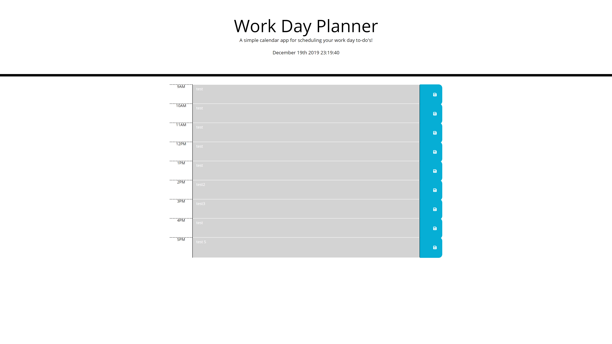

# UPENN-WEEK-5-HOMEWORK-DAYPLANNER

## Purpose

To have a single-day to-do list to help organize your day.

## Usage

 Users can enter plain text in each input field for each hour of the day between 9am and 5pm local time. The planner lets you know the local date and time at the top of the page, and the cell color will change based on the current time of day as follows:  
 Current hour will be red  
 Past hours will be gray  
 Future hours will be green.  
 Note: at 6pm local time every time block will turn gray and be considered past until midnight local time when everything will turn green and be considered future.

 The planner will save your inputs so you can close the app and return later to see what you previously signed yourself up to do! 

 

 #### Live Site
 
 https://tdj03001.github.io/UPenn-Week-5-Homework-DayPlanner/
 
 
 # GitHub Repo
 
 https://github.com/tdj03001/UPenn-Week-5-Homework-DayPlanner
 
